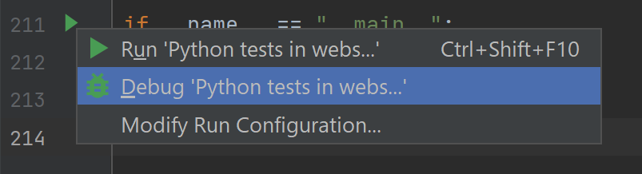

Selenium bot
##############################################################

.. image:: ./_pictures/UFO_mamy.png
   :align: center
   :width: 800
   :alt: All layers

.. contents:: Contents
    :local:

11. Add-on Selenium bot demo on UDF lab
##############################################################

Local environment
*****************************************
- Install `Python <https://www.python.org/>`_
- Install `PyCharm <https://www.jetbrains.com/pycharm/>`_
- Open PyCharm
    - Create a new project by cloning this github repository
    - Attach a `Python interpreter <https://www.jetbrains.com/help/pycharm/configuring-python-interpreter.html>`_
- Install Selenium following `this guide <https://selenium-python.readthedocs.io/installation.html#installation>`_
- Copy downloaded ``chromedriver.exe`` file in ``./_files/chromedriver.exe`` of your project
- Open file ``requirements.txt`` and install package ``selenium``
- Go to directory where python binary is stored and then install 2captcha ``.\pip3.exe install 2captcha-python``

Remote environment
=========================================
- Deploy the blueprint ``Advanced WAF Demo v16 + LCC, ML, Device ID+ and IBD`` / version of 30/09/2021 and after
- Start the deployment ``Advanced WAF Demo v16 + LCC, ML, Device ID+ and IBD``
- Get Hackazon URI: ``Components`` >> ``BIG-IP`` >> ``Details`` >> ``Access methods`` >> ``IBD Demo with Hackazon as backend`` >> ``External``
- Get Hackazon user credential (login and passowrd) : ``Components`` >> ``LAMP-server`` >> ``Details`` >> ``Access methods`` >> ``Description`` >> <login>/<password>
- Open the e-mail received from Cloud Services and connect to IBD portal

Test 1 - Human
=========================================
*Task*
    - Open a web browser
    - Paste *Hackazon URI* and append PATH ``/user/login``
    - Try to login using the user credential and solving the CAPTCHA

*output*
    - You have been redirected to ``/account``

*Clean*
    - Logout

Google recaptcha API key
=========================================
- A Google Recaptcha account has been already created
- A ``site key`` and a ``secret key`` was added in Application's code.
- Use `2captcha user guide <https://2captcha.com/2captcha-api#solving_recaptchav2_new>`_ to find the ``site key``
- For trainer: statistics are available `here <https://www.google.com/recaptcha/admin/site/479852569>`_

Selenium bot - bypass CAPTCHA, viva 2CATPCHA!
=============================================
*Task*

- In PyCharm, open ``website11.py``
- Click on ``Structure`` and open ``setUp`` function

- Set global variables

.. code-block:: bash
        URI = "https://{{your_hackazon_uri}}/user/login"
        LOGIN_USER = "test_user"
        LOGIN_PASSWORD = "123456"
        CAPTCHA_API_KEY = "{{ask_your_trainer}}"

- Set global variables

- Click on the left column, as described in the picture below, to suspend the script during his future execution

- Go to the end of the file and click on the green triangle

- Choose debug mode

- The script launch a Web browser controlled by Selenium

- Just for your understanding, when the script is suspended, locate the element in the Web browser's dev tool windows >> Elements tab

- Execute next action by clinking on "go to cursor"

*output*
    - Bot succeed to login and he is redirected to ``/account``

Configure Integrated Bot Defense
=========================================
- Get BIG-IP credential: ``UDF`` >>` `Components`` >> ``BIG-IP`` >> ``Details`` >> ``Credentials``
- Connect to BIG-IP: ``UDF`` >>` `Components`` >> ``BIG-IP`` >> ``Access`` >> ``TMUI``
- Open IBD iApp: ``iApps`` >>` `App Services`` >> ``Hackazon_IBD`` >> ``Reconfigure``
- Set parameters:
    - Entry points | JS Injection Paths: GET ``/user/login``
    - Endpoints | Paths to be Routed to Shape >> Host ``HOST_of_your_hackazon_URI``
    - Endpoints | Paths to be Routed to Shape >> Mitigation Action ``block``
    - Block Data:

.. code-block:: html

    <h1 class='page-title'>Demo | Blocked by Shape | Demo</h1>

- Click on ``Finished`` to reconfigure

Selenium bot - mitigated
=============================================
*Task*
- In PyCharm, run a test

*output*
- See page ``Demo | Blocked by Shape | Demo``

